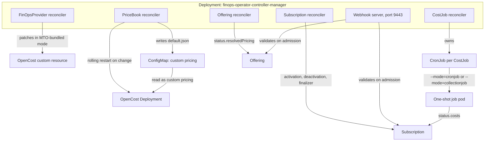
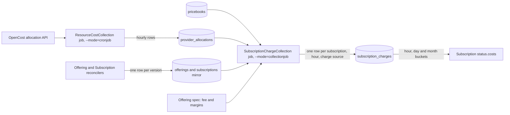

# Architecture

The FinOps Operator expresses cost accounting as five Kubernetes resources and reconciles all of them from a single Deployment. The work that actually moves data — pulling allocation data out of OpenCost, pricing it, and writing charges — does not run in that Deployment. It runs in short-lived CronJobs that the operator creates from the [`CostJob`](costjob.md) resources you author, so collection is scheduled, restartable, and visible as ordinary Kubernetes Jobs.

## Components

| Component | Description |
| --- | --- |
| `finops-operator-controller-manager` Deployment | One process running five reconcilers, one per custom resource, plus the admission webhook server. Health and readiness probes are served on `:8081`. |
| Webhook server | Serves the `Offering` and `Subscription` validating webhooks on container port 9443, fronted by the `finops-operator-webhook-service` Service. It runs inside the controller-manager process, so there is no separate webhook Deployment. |
| A `CronJob` per `CostJob` | Created and owned by the CostJob reconciler, named `<costjob-name>-cronjob` in the CostJob's namespace. Each firing starts one pod that runs the operator image in a one-shot mode and exits. The template sets `concurrencyPolicy: Forbid`, so a slow run is never overlapped by the next schedule. |

OpenCost and PostgreSQL are dependencies rather than components. The operator configures OpenCost and reads allocation data from it, and keeps everything durable in PostgreSQL. Whichever mode starts first applies any outstanding schema migrations when it connects.

## The three binary modes

The operator image is one binary with a `--mode` flag, and the mode decides whether the process is a controller or a job.

| `--mode` | Set by | Lifetime | Work |
| --- | --- | --- | --- |
| `controller` | The default when the flag is omitted, which is how the Deployment runs it | Long-lived | The five reconcilers and the webhook server |
| `cronjob` | The generated CronJob for a `ResourceCostCollection` CostJob | One shot | Fetch allocation data from OpenCost and stream it into PostgreSQL |
| `collectionjob` | The generated CronJob for a `SubscriptionChargeCollection` CostJob | One shot | Compute subscription charges, persist them, and refresh each Subscription's `status.costs` |

`controller` is the only mode you ever set, and in the shipped chart even that is left implicit. The CostJob reconciler derives the other two from `spec.type` and writes the matching `--mode` argument onto the CronJob it generates, so you choose between them by choosing a CostJob type rather than by configuring a flag.

## What each reconciler does

| Reconciler | Responsibility |
| --- | --- |
| FinOpsProvider | Reads the single cluster-scoped provider, works out whether a cloud integration secret and custom pricing apply, and in Multi Tenant Operator (MTO) bundled mode patches the `OpenCost` custom resource accordingly. |
| PriceBook | Validates each book's rates, elects exactly one active book across the cluster, and renders the active one into OpenCost's custom pricing document. |
| CostJob | Reconciles each CostJob into a `CronJob`, deriving the schedule from `spec.interval` and the mode from `spec.type`. |
| Offering | Validates required offerings, resolves per-meter unit prices from the active PriceBook onto `status.resolvedPricing`, and blocks deletion while dependents exist. |
| Subscription | Runs the activation gates, stamps `status.activatedAt` and `status.compatibilityRoot`, deactivates on a lost parent, lost coverage, or a deleted target, and mirrors every version into PostgreSQL. |

## How the active PriceBook reaches OpenCost

Every PriceBook reconcile does three things in order: validate the book's own rates and record its `Ready` condition, elect the single active book across the whole cluster, and then, only for the book that won, push pricing to OpenCost. A reconcile of a non-active book stops after the election, so the pricing document never depends on which object happened to be reconciled last.

Pushing pricing means rendering the active book's rates into a `default.json` document and writing it into the `finops-operator-custom-pricing-configs` ConfigMap in the OpenCost deployment's namespace. The document carries `provider: custom`, an unset rate is written as `"0"` rather than an empty string, and the single `networkGiB` rate fills all three of OpenCost's egress fields, so zone, region, and internet egress are priced identically. The map that was applied is mirrored back onto the book's `status.activePricing`.

OpenCost only reads that document at startup, so the operator restarts it — but only when the content actually changed. The ConfigMap is written with a create-or-patch, and only a `Created` or `Updated` result triggers a patch of the OpenCost Deployment's pod template annotation `finops.stakater.com/restartedAt`, which is what causes the rolling restart. An unchanged document logs and does nothing, so a busy reconcile loop does not restart OpenCost repeatedly.

!!! note
    If the active book's rates fail to parse, the operator leaves the last good document in place and surfaces the failure through that book's `Ready` condition rather than pushing rates it could not read to OpenCost.

In MTO-bundled mode the FinOpsProvider reconciler also patches the `OpenCost` custom resource in the `dependencies.tenantoperator.stakater.com` API group, and restarts OpenCost only if that patch changed anything. Outside MTO-bundled mode the FinOpsProvider path deliberately does nothing to the Deployment, leaving the ConfigMap and the restart entirely to the PriceBook reconciler so the two never restart OpenCost twice for one change.

## How allocation data reaches PostgreSQL

A `ResourceCostCollection` CostJob produces a CronJob whose pod runs in `cronjob` mode. Each run reads its CostJob by name from the environment, connects to PostgreSQL, and pins the hour it is processing from the `SCHEDULED_TIMESTAMP` environment variable, which the pod template wires to the CronJob's `batch.kubernetes.io/cronjob-scheduled-timestamp` annotation. Pinning the hour is what makes a Kubernetes retry reprocess the same window instead of drifting to the current one.

The run then resolves a PriceBook for the CostJob's namespace, writes its rates into the `pricebooks` table in micro-currency, and stamps that row's id and currency onto every allocation row it writes. Rows come from OpenCost's allocation API, aggregated by namespace, pod, and container by default, and land in the `provider_allocations` table keyed on cluster, name, namespace, aggregation, and hour, so a replayed run overwrites rows rather than duplicating them.

Within one transaction the job walks a configurable number of preceding hours, skipping any hour already fully finalized, and writes them with `is_finalized = true`; the scheduled hour itself is written with `is_finalized = false` because it is still in progress. After the transaction commits, any straggling non-finalized rows older than the scheduled hour are finalized, and the `mv_provider_allocations_summary` materialized view is refreshed if rows were inserted. Every run appends an execution record to the CostJob's `status.executionHistory`, which keeps the last ten.

## How charges reach `Subscription.status.costs`

A `SubscriptionChargeCollection` CostJob produces a CronJob whose pod runs in `collectionjob` mode. Each run lists every Subscription, skips the ones that were never activated, and fetches each remaining Subscription's Offering. It then computes one cluster-wide allocation boundary, the earliest hour whose allocation rows are not yet finalized, and uses that same value for both charging and cleanup so the two cannot disagree within a run.

Charges are written per hour. For each Subscription the job builds one calculator for the subscription fee, if the Offering declares one, plus one calculator per usage meter, if the Subscription declares `usageSources` and the Offering declares `resourcePricing`. Usage meters read the allocation rows for the window and take their per-unit rate from the `pricebooks` row joined to each allocation row, then apply that meter's margins from the Offering. The subscription fee comes from the Offering's `subscriptionFee` and needs no allocation data at all.

Each run makes two passes. The finalized pass walks hour by hour from the Subscription's watermark, the latest hour it has already finalized, up to the scheduled hour, writing one row per Subscription, per hour, per charge source, keyed on cluster, subscription, hour, and source. A usage-metered Subscription whose window sits at or after the allocation boundary is still charged from whatever data exists, but the row is written `finalized = false` so a later run recomputes and promotes it once the allocations settle. The current-hour pass then rewrites the in-progress hour as `finalized = false` on every tick, refining it until the hour closes.

Only then does status get written. Rolling hour, day, and month buckets are built for each Subscription, with the accumulated figure read back from `subscription_charges` and the projected figure computed from the fee, and the three buckets are written to `status.costs` along with a `CostsResolved` condition whose reason records whether the numbers came from the database or from the calculator fallback.

The same job owns cleanup. The Subscription reconciler adds a finalizer on first sight and, on deletion, deactivates the Subscription and records `DeletionBlocked` while it waits. The collection job removes that finalizer only once the Subscription is deleting and deactivated, at least `minPeriods` ticks have elapsed since activation, and charges are finalized through its last billable hour. Any error recorded against a Subscription during the run keeps its finalizer, so the next tick retries rather than tearing down an object whose final hours were never charged. The [deactivate a subscription](../guides/deactivate-a-subscription.md) guide walks through what that looks like in practice.

## Admission validation and CRD validation

Both `Offering` and `Subscription` have validating webhooks, and both fail closed. What they check is narrow, because most of the operator's rules are continuous rather than admission-time.

| Check | Where it runs |
| --- | --- |
| An Offering whose `compatibility.requiredOfferings` forms a self-reference or a dependency cycle | Offering webhook, on create |
| An Offering that other Offerings require, or that Subscriptions still reference | Offering webhook, on delete |
| A Subscription naming itself as its own `parent` or as its own `lifecycle.targetRef` | Subscription webhook, on create |
| `FinOpsProvider` must be named `default`, and must carry exactly one provider option | CRD validation rules on the type |
| `Offering.spec` immutable; `Subscription.spec.offeringRef` and `spec.parent` immutable | CRD validation rules on the type |
| `period` format matching `tickAlignment`; `absoluteMicros` and `factorMilli` mutually exclusive and non-negative; every reference carrying an explicit `namespace` | CRD validation rules on the type |
| Offering readiness, parent readiness, compatibility coverage, target existence | Reconcilers, continuously |

The last row is the important one. A Subscription is not rejected for referencing an Offering that is not ready yet; it is admitted and held not ready until the reference resolves, and it is deactivated later if coverage it depends on goes away. See [webhooks](../reference/webhooks.md) for the full admission surface and [status conditions](../reference/status-conditions.md) for the conditions and reasons the reconcilers write.

## Next

- [Terminology](terminology.md) for the vocabulary this page uses.
- [Billing model](billing-model.md) for how ticks, proration, and the deactivation snap decide what a fee comes to.
- [Compatibility and hierarchy](compatibility-and-hierarchy.md) for the family and coverage rules the Subscription reconciler enforces.
