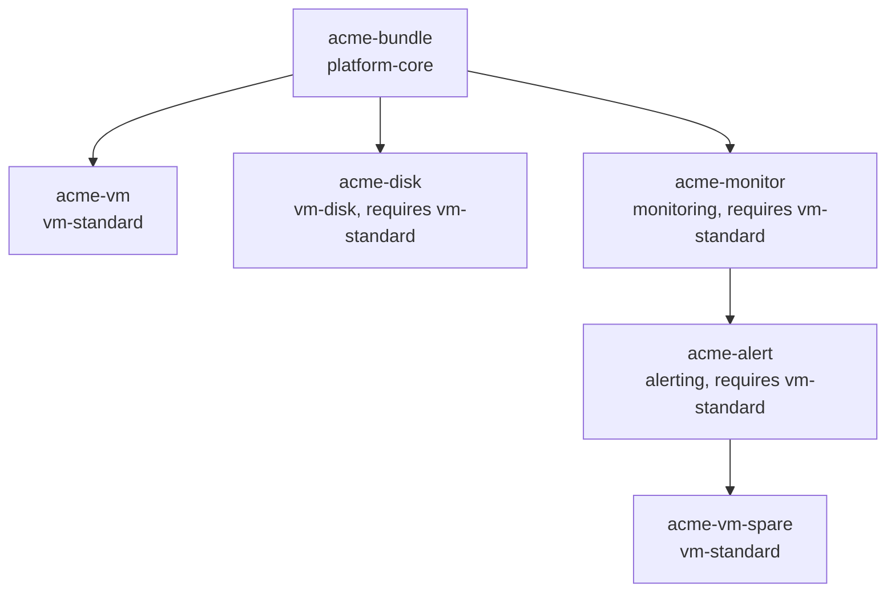

# Compatibility and hierarchy

Two separate mechanisms meet on this page. `Subscription.spec.parent` builds a tree, which is how a disk Subscription says it belongs to a VM Subscription and how a bill can be read as a structure rather than a flat list. `Offering.spec.compatibility.requiredOfferings` states that an Offering may only be sold alongside others, and the operator turns that statement into a test against the tree. Whoever provisions a tenant builds the tree; whoever authors the Offerings decides what has to be in it.

The two combine into one rule: a Subscription activates only when every Offering its own Offering requires is already bound by an active Subscription somewhere else in the same tree.

## Naming a parent

`spec.parent.subscriptionRef` is a plain reference to another Subscription, and its `namespace` is required with a minimum length of one character. It is never filled in from the child's own namespace, so a family can span namespaces and a manifest means the same thing wherever it is applied.

```yaml
spec:
  offeringRef:
    name: vm-disk
    namespace: finops-operator-system
  parent:
    subscriptionRef:
      name: acme-vm
      namespace: finops-operator-system
```

The block is immutable, presence included, so a `parent` can neither be added later nor removed. [Subscription](subscription.md#what-it-points-at-and-why-that-is-fixed) has the CEL rules and the messages they reject with. A Subscription that names itself as its own parent is refused at admission by the validating webhook on create, with reason `CircularDependencyDetected`, and the reconciler repeats the check on every pass.

Having a parent is a gate on activation, not just a label. The parent must exist, must not be deactivated, and must be ready; otherwise the child is held at `Ready=False` with `ParentSubscriptionNotFound`, `ParentSubscriptionDeactivated`, or `ParentSubscriptionNotReady`. The first two are terminal verdicts, because deactivation and deletion never reverse, and an already-active child resolves them through its lifecycle policy. The third is transient and nothing cascades on it.

## The family and its root

A family is the connected tree of Subscriptions that share one root ancestor. Each Subscription records which family it is in as `status.compatibilityRoot`, holding the `metadata.uid` of the root, and every member of a family carries the same value. A Subscription with no parent is its own root and stamps its own UID.

The reconciler resolves it by walking up `spec.parent.subscriptionRef` until it reaches a Subscription with no parent, and it does so once. The value never needs revisiting, because `parent` is immutable and the root is therefore fixed for life. Stamping runs after the parent gate and before the coverage check, so a Subscription whose ancestor chain is not fully present yet is not stamped at all: it is already being held not ready by the parent gate, and the next reconcile retries. The field is also a selectable field on the CRD and indexed in the operator's cache, which is what lets a whole family be fetched in one query rather than by walking pointers.

!!! warning
    One case cannot resolve a root. A Subscription that was already active before family coverage shipped, and so carries no `status.compatibilityRoot`, cannot be stamped if its parent was deleted before its first reconcile on the new version, because the walk up passes through a Subscription that no longer exists. Where the lifecycle policy keeps such a Subscription alive, it stays active and keeps syncing to the database, the reconcile keeps retrying at ever longer intervals, and it never joins family coverage. Reconcile once while the parent still exists, or set `status.compatibilityRoot` by hand. This cannot happen to anything created since, because stamping always precedes activation.

## Who can cover a requirement

An Offering states its requirements as references, each with an explicit `namespace`:

```yaml
spec:
  compatibility:
    requiredOfferings:
      - name: vm-standard
        namespace: finops-operator-system
```

Coverage is then searched across the Subscription's whole family, minus the Subscription itself and everything beneath it. A requirement is covered when some other member of the family is active and its `offeringRef` names exactly that Offering, matched on namespace and name. "Active" means the member has an `activatedAt` and no `deactivatedAt`; readiness is not consulted, so a provider whose own Offering has gone not ready still covers what it covers.



`acme-disk` and `acme-monitor` are covered by their sibling `acme-vm`, and so is `acme-alert`, one level deeper, whose provider is its uncle: the search is the family, not one hop, so ancestors, siblings, uncles and cousins all count. `acme-vm-spare` binds `vm-standard` as well and is active, but it covers nothing for `acme-alert`, because it sits below `acme-alert` and coverage never flows up from a Subscription's own dependents. Delete `acme-vm` and all three requiring Subscriptions lose coverage even though `vm-standard` is still bound in the family.

The same rule has a consequence at the top of the tree. Everything below a root is the entire family, which leaves a root no candidates at all, so an Offering with `requiredOfferings` can never be satisfied by a Subscription that has no parent. Requirements belong on Offerings meant to be subscribed underneath something.

## Coverage is not a one-time check

The check runs on every reconcile, and what a failure costs depends on where the Subscription is in its life. One that has not activated yet is held at `Ready=False` with reason `CompatibilityRequirementNotMet` and waits, activating on its own once a provider appears. One that is already active is deactivated with that same reason, and deactivation is terminal, so bringing the provider back does not bring the Subscription back. A lookup failure is treated differently from a coverage gap: if the Offering cannot be read at all, an active Subscription is retried rather than ended.

Propagation is event-driven. A create, a delete, or a flip in any member's activation state re-enqueues every member of that family, and each one then re-evaluates its own coverage; routine status writes such as refreshed cost buckets do not trigger the fan-out. A member with no root stamped yet fans out to nothing, and picks itself up on its own reconcile. Because deactivation only ever moves one way, a cascade through a family always settles instead of oscillating.

## When a parent goes away

`lifecycle.onParentDeactivate` decides what an active child does when its parent is deactivated or deleted. `Deactivate`, the default, ends the child too, recording `Active=False` with reason `ParentDeactivated`. `Orphan` keeps it active and keeps the `parent` reference for traceability, and its activation is recorded with reason `Orphaned`. The value comes from the Subscription's own `spec.lifecycle` when that block is present, otherwise from the Offering's `lifecycle.onParentDeactivate`, otherwise `Deactivate`.

`Orphan` detaches the lifecycle link and nothing else. Compatibility still applies to an orphan, so if the parent that just went away was the only active provider of a required Offering, the orphan is deactivated for the coverage gap on the very same reconcile, with reason `CompatibilityRequirementNotMet` rather than `ParentDeactivated`. `Orphan` is a statement about lifecycle coupling, not an exemption from the requirement.

!!! warning
    `lifecycle.allowOverride` on the Offering is declared in the API and nothing reads it at this release, so an Offering cannot in fact stop a Subscription from choosing its own policy. Any Subscription carrying a `spec.lifecycle` block supplies its own `onParentDeactivate`, and because that field defaults to `Deactivate`, a Subscription that sets only `lifecycle.targetRef` silently overrides an Offering's `Orphan` policy back to `Deactivate`.

## Cycles in both graphs

Two graphs can close on themselves, and both are guarded under one reason.

| Graph | Edge | Checked by |
| --- | --- | --- |
| Offering requirements | `compatibility.requiredOfferings` | The Offering webhook on create, and the Offering reconciler on every pass |
| Subscription parents | `spec.parent.subscriptionRef` | The Subscription webhook on create, and the parent gate on every pass |

The Offering graph is walked depth first from the Offering being validated. A self-reference, or any requirement path that returns to an Offering already on the stack, is reported as `CircularDependencyDetected` with the path that closed the loop. Offerings that do not exist are skipped rather than treated as failures, since a missing Offering cannot close a cycle; the reconciler reports those separately as `RequiredOfferingNotFound`, and a required Offering that exists but is not ready as `RequiredOfferingNotReady`. Keeping this graph acyclic is also what guarantees a family has a workable activation order, because it fixes the direction requirements point in.

On the Subscription side only a self-reference is rejected outright, again as `CircularDependencyDetected`. A longer parent cycle, such as two Subscriptions naming each other, is admitted and then goes nowhere: neither can pass the parent gate, because each waits on the other to be ready, and both sit at `ParentSubscriptionNotReady` indefinitely. Root resolution carries its own guard for the same shape and refuses to loop, but the parent gate reaches that state first.

## Related

- [Compose subscriptions](../guides/compose-subscriptions.md) for building a family, and [deactivate a subscription](../guides/deactivate-a-subscription.md) for taking one apart.
- [Offering](offering.md#compatibility-requirements) for declaring requirements, and [Subscription](subscription.md#the-four-activation-gates) for where coverage sits among the activation gates.
- [Status conditions](../reference/status-conditions.md) for the full reason vocabulary.
- [`Compatibility`](../reference/api.md#compatibility), [`SubscriptionParent`](../reference/api.md#subscriptionparent), and [`SubscriptionLifecycle`](../reference/api.md#subscriptionlifecycle) for the field-level reference.
