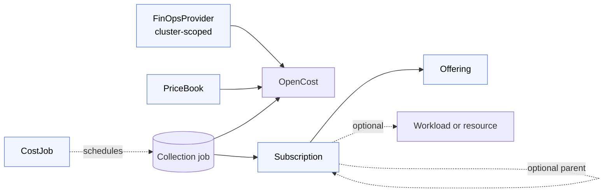

# Concepts

This section explains the mental model behind the FinOps Operator. The operator manages cost accounting for Kubernetes workloads through five Custom Resource Definitions that form a small, composable system — each resource has a clear role, and together they take you from raw pricing data to per-tenant subscription charges.

## The five resources

[**FinOpsProvider**](./finops-provider.md) is the cluster-scoped entry point. It names the cloud environment the cluster runs in and tells the operator how pricing reaches OpenCost. There is exactly one FinOpsProvider per cluster, and it must be named `default`.

[**PriceBook**](./pricebook.md) defines per-resource rates — CPU-hour, RAM GB-hour, GPU-hour, storage, and network — in a chosen ISO 4217 currency. The operator uses these rates to configure OpenCost's custom-pricing path so that raw allocation data is costed at your declared rates rather than cloud-provider list prices.

[**CostJob**](./costjob.md) is a schedule. It tells the operator how often to pull allocation data from OpenCost and how often to compute subscription charges. The operator turns each CostJob into a Kubernetes CronJob that runs on the specified interval.

[**Offering**](./offering.md) is a named, immutable pricing contract for something that costs money — for example, a managed database tier, a GPU workload, or a platform base fee. An Offering carries a recurring subscription fee and optional compatibility and lifecycle rules for its subscribers.

[**Subscription**](./subscription.md) is an active binding to an Offering. It can optionally reference a parent Subscription and a Kubernetes target resource. When a Subscription is active, it accrues charges reported in its status across three rolling time buckets: hour, day, and month.

## How they relate

For a hands-on walk-through that creates each of these resources in order, see [Getting started](../getting-started/index.md).
