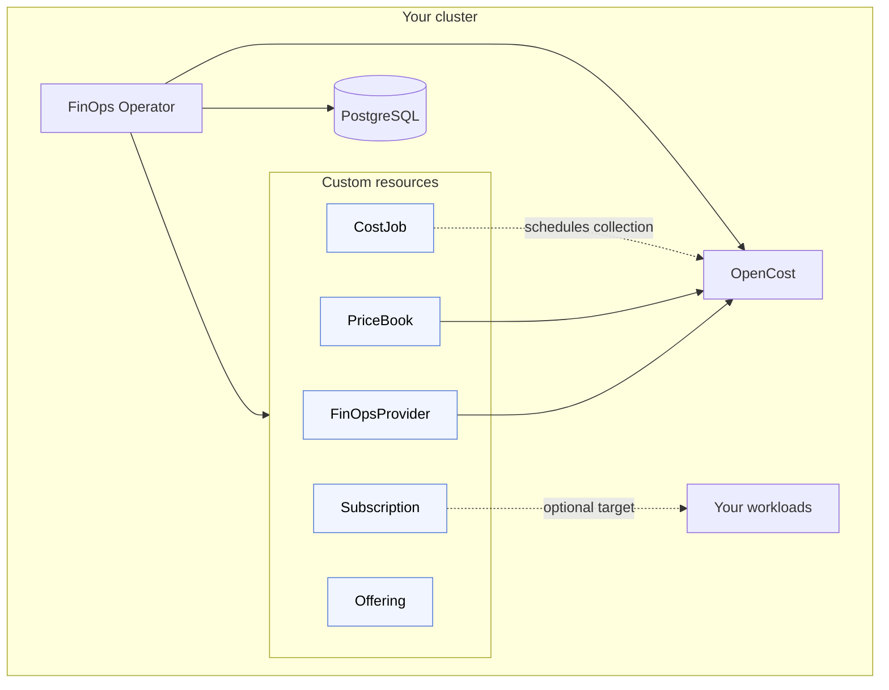

# FinOps Operator

The FinOps Operator manages cost accounting for Kubernetes workloads through five custom resources that compose into a small, cloud-agnostic billing system.

## What it solves

- **Per-workload and per-tenant cost visibility** — collect allocation data from OpenCost and attribute costs to individual namespaces, workloads, or tenants.
- **Chargeback and showback** — report accrued charges in Subscription status so platform teams can bill or report costs back to internal consumers.
- **Subscription-based internal pricing** — define named Offerings (for example, "managed Postgres" or "GPU workload") with recurring fees, then subscribe internal teams to them so their namespace accumulates charges automatically.
- **Multi-cloud pricing abstraction via OpenCost** — a single FinOpsProvider object declares whether the cluster runs on AWS, GCP, Azure, or on-premises; pricing flows through OpenCost regardless of the underlying cloud.

## How it fits together

The five custom resources work together with OpenCost and PostgreSQL to collect, compute, and record costs. The operator reconciles the resources and drives the data flow between them.

## Who this is for

This documentation is aimed at platform engineers, SREs, and FinOps practitioners who run Kubernetes and want to attach cost signals to their workloads and internal services. You should be comfortable creating and inspecting Kubernetes custom resources with `kubectl`. No prior knowledge of the operator's internals is required.

## Start here

- [Getting Started](getting-started/index.md)
- [Concepts](concepts/index.md)
- [Guides](guides/define-pricing.md)
