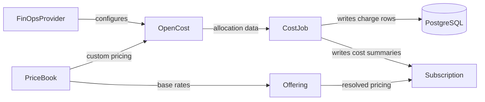

# FinOps Operator

The FinOps Operator performs cost accounting for Kubernetes workloads. It collects allocation data for what actually ran in the cluster, prices that usage against rates you declare, and bills the result to whoever subscribed to it. The whole model is expressed as Kubernetes resources, so a platform engineer, SRE, or FinOps practitioner who is comfortable with `kubectl` can publish an internal price list, attach it to a service, and read accrued charges back from a resource status without leaving the cluster.

Five custom resources in the `finops.stakater.com/v1alpha1` API group carry that model.

| Resource | What it is |
| --- | --- |
| [`FinOpsProvider`](concepts/finops-provider.md) | A cluster-scoped singleton, always named `default`, that declares where the cluster runs, exactly one of AWS, GCP, Azure, or on-premises, and configures the OpenCost integration. |
| [`PriceBook`](concepts/pricebook.md) | A currency and a set of per-unit rates for CPU, GPU, RAM, persistent volumes, and network transfer, with separate spot rates for CPU and RAM. One PriceBook at a time is the active one, and its rates are what everything else prices against. |
| [`CostJob`](concepts/costjob.md) | A collection schedule. The operator turns each CostJob into a Kubernetes `CronJob` that either pulls allocation data out of OpenCost or computes subscription charges. |
| [`Offering`](concepts/offering.md) | A cost-driving entity and the rules for pricing it: a recurring subscription fee, per-meter margins on measured usage, or both. Its spec is immutable once created. |
| [`Subscription`](concepts/subscription.md) | A binding to an Offering that represents active consumption. While it is active it accrues charges, and it can hang off a parent Subscription to model add-ons. |

An Offering is the catalogue entry and a Subscription is the thing being billed, so pricing is authored once and consumed many times.

## OpenCost and PostgreSQL

The operator does not measure resource consumption itself. [OpenCost](https://opencost.io) does that, and the operator drives it from two directions: `FinOpsProvider` configures the OpenCost integration for the cluster's provider, and the active `PriceBook` is rendered into OpenCost's custom pricing document so OpenCost values usage with your rates rather than a public cloud price list. Subscription charges are then computed from the PriceBook rates directly rather than from OpenCost's own cost figures, which keeps billing arithmetic independent of how OpenCost happens to interpret the document.

PostgreSQL is where anything durable lands. The collection CronJobs write OpenCost allocation rows there, controllers mirror every version of every Offering and Subscription into it, and the charge collector writes one row per subscription, per hour, per charge source. Rolling summaries for the current hour, day, and month are copied back onto `Subscription.status.costs` so the cheap answer is available from `kubectl` without querying the database.

## Next

Start with the [installation overview](getting-started/installation/overview.md), then work through the [quick start](getting-started/quick-start.md) to get a price list, an offering, and a subscription in place.
